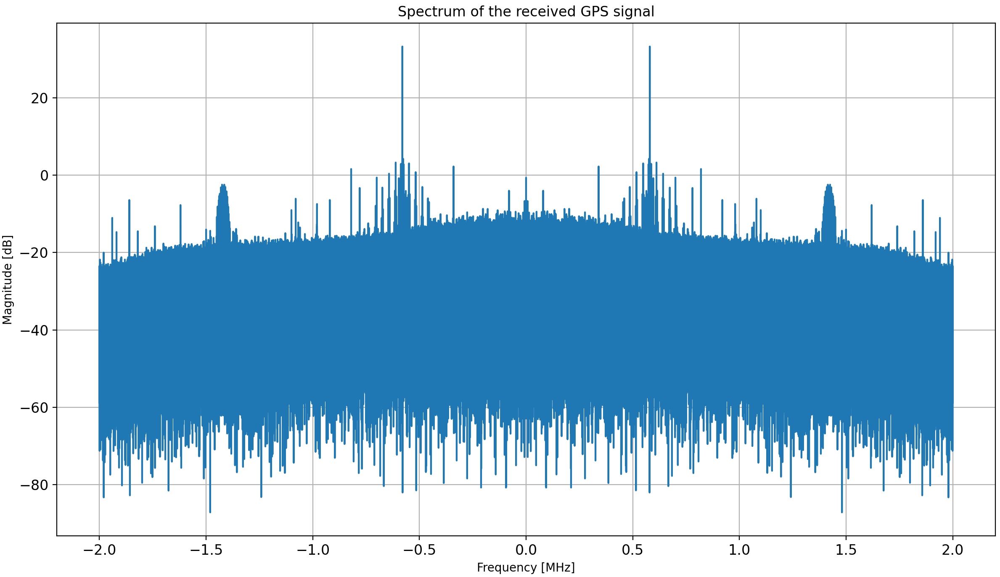
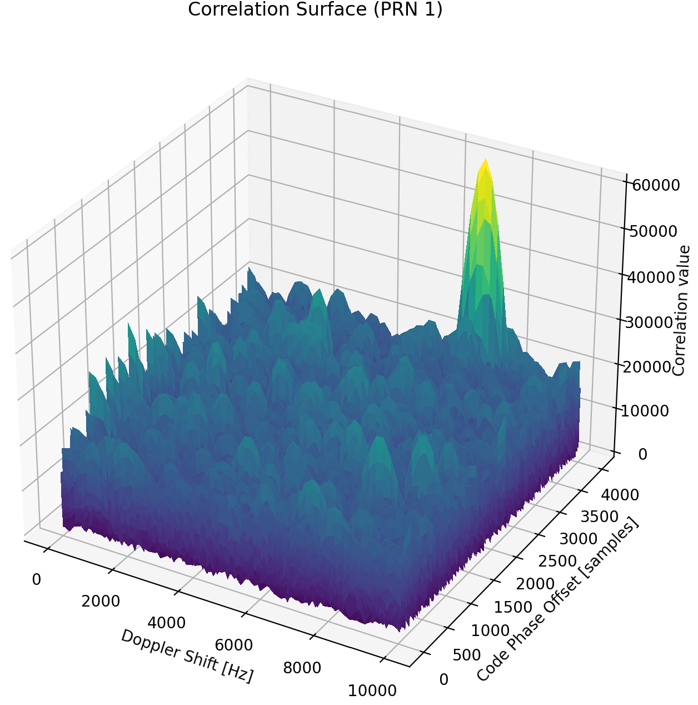
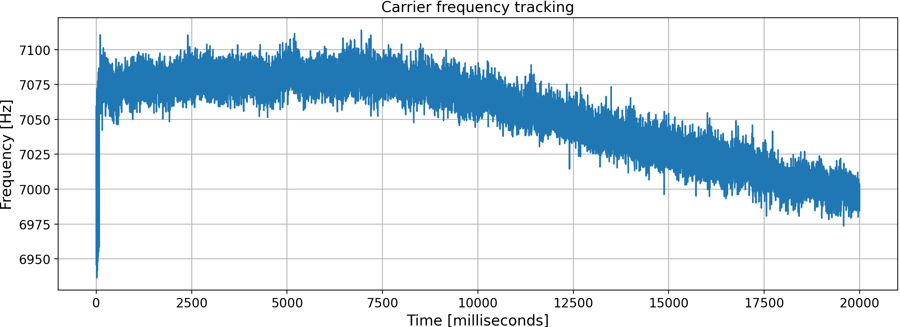
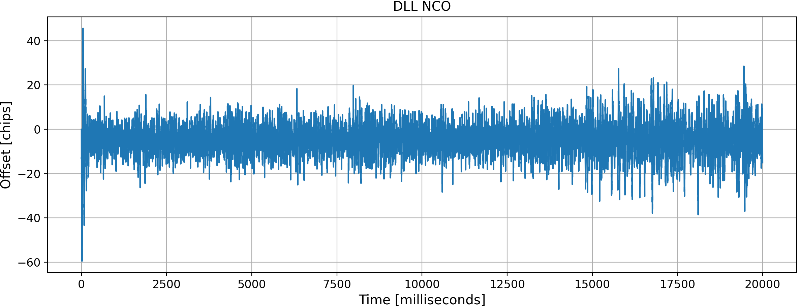
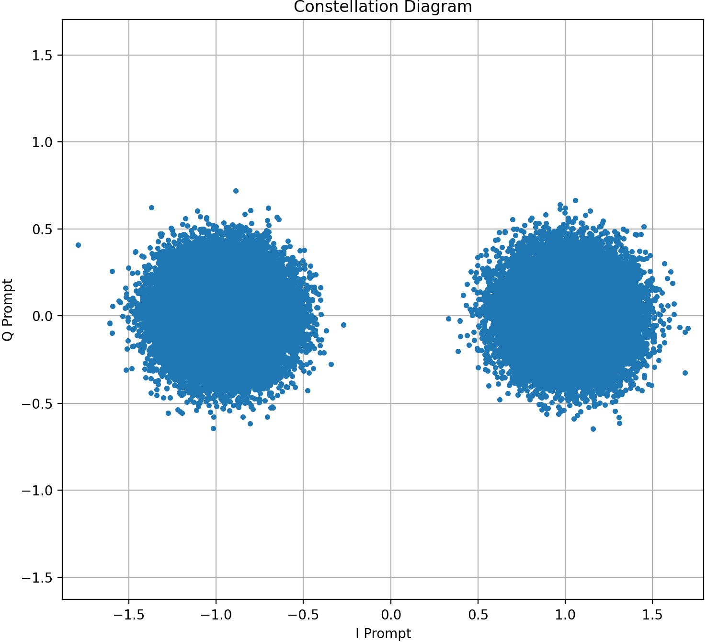
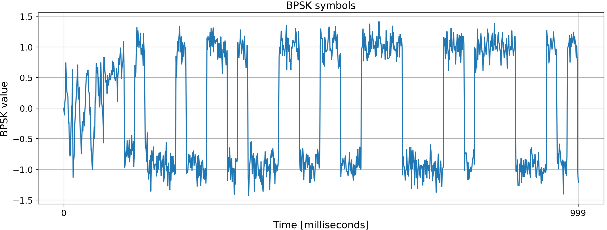

# 🛰️ Python GPS receiver

This project implements a software-defined GPS L1 receiver in Python. It covers the full signal processing chain required to extract navigation messages from raw real-valued samples, based on the standard GPS signal structure and BPSK modulation.

## 📦 Features
- Reads raw real-valued data from `.dat` file (`int16` format)
- Signal spectrum visualization (optional)
- Satellite acquisition using correlation techniques
- Carrier and code tracking loop (DLL + PLL)
- Digital demodulation (BPSK)
- Navigation message decoding

## 🚀 Quick Start

### Requirements
- `Python3.7` or higher
- `pip3`
- `numpy`
- `scipy`
- `matplotlib` (optional, for plotting)

Install dependencies:
```bash
pip3 install -r requirements.txt
```

### Input data
To test the receiver, you will need raw sample data recorded from a GPS L1 signal. This receiver processes only the real (in-phase) component of the signal – not complex I/Q data. Make sure the file contains signed 16-bit integers (int16) representing real-valued samples.

If you don't have your own recordings, you can use public datasets as a starting point and extract only the real part if needed. Sample data can be downloaded e.g. from [gnss-sdr](https://github.com/gnss-sdr/gnss-sdr) project page on [SourceForge](https://sourceforge.net/projects/gnss-sdr/files/data/). Alternatively (on Linux or WSL), use this `wget` command in your terminal:
```bash
wget https://sourceforge.net/projects/gnss-sdr/files/data/2013_04_04_GNSS_SIGNAL_at_CTTC_SPAIN.tar.gz
```
If the estimated download time is too long, you can also download the data using Google Colab and then copy it to your Google Drive after mounting the drive in Colab Notebook.

Then unpack the archive:
```bash
tar -zxvf 2013_04_04_GNSS_SIGNAL_at_CTTC_SPAIN.tar.gz
```

Finally, run the script to extract only the real component of the signal:
```python
python3 prepare_data.py
```

## ▶️ Usage
In the `main.py` file, adjust the sampling frequency `fs` to match your input data. A default value of 4 MHz is provided for compatibility with the [gnss-sdr](https://github.com/gnss-sdr/gnss-sdr) dataset. You can also enable or disable plotting by setting the `plot` boolean variable. Then run:
```python
python3 main.py
```

## 📈 Output
### 1. Signal spectrum visualization

### 2. Correlation surface received in the signal acquisition phase

### 3. Carrier frequency tracking

### 4. Code-phase offset correction over time

### 5. BPSK constellation diagram

### 6. BPSK symbols


## 📄 Decoding results
```plaintext
```
